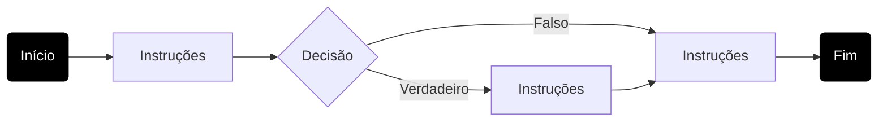
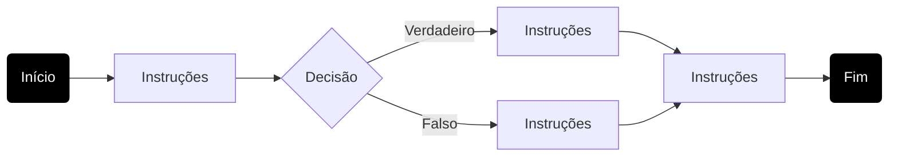
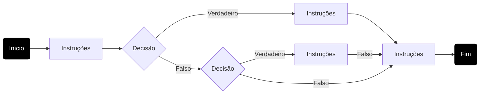
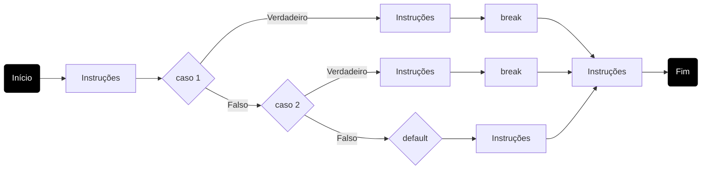
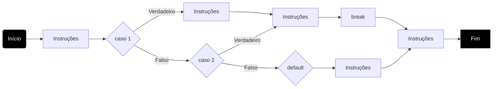
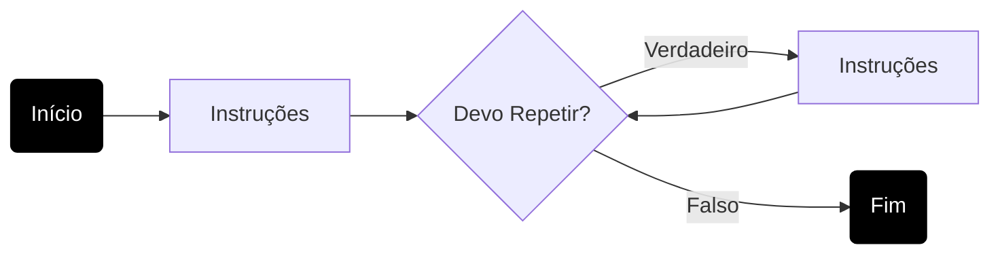
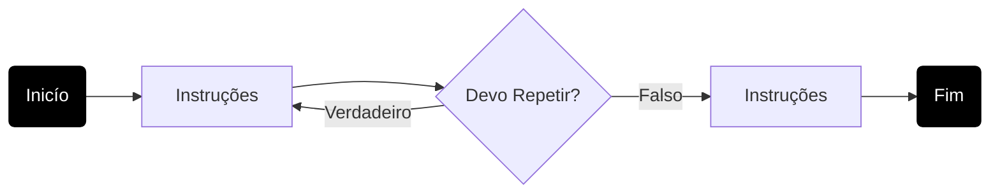
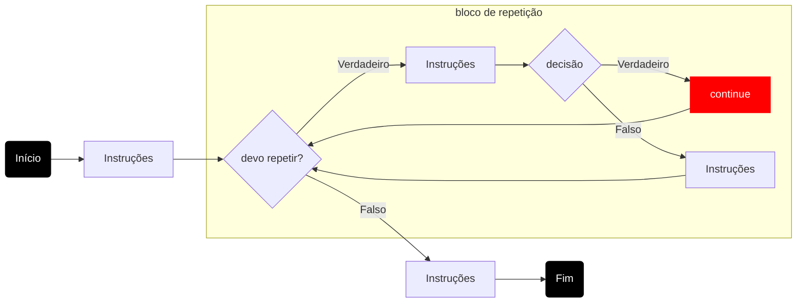
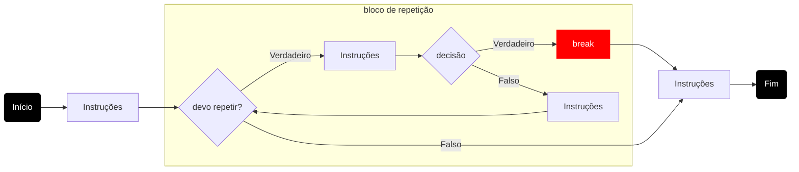

# Fluxo de Controle


## Estruturas de Decisões

### if-else-then



``` java
instruções;
if(DECISAO){
  instruções;
}
instruções;
```



``` java
instruções;
if(DECISAO){
  instruções;
}else{
  instruções;
}
instruções;
```




``` java
instruções;
if(DECISAO){
  instruções;
}else if(DECISAO){
  instruções;
}
instruções;
```

### switch



``` java
instruções;
switch(VARIAVEL){
  case 1:
      instruções;
      break;
  case 2:
      instruções;
      break;
  default
      instruções;
}
instruções;
```



``` java
instruções;
switch(VARIAVEL){
  case 1:
      instruções;
  case 2:
      instruções;
      break;
  default
      instruções;
}
instruções;
```

## Estruturas de Repetições



## for

``` java

for(inicialização; decisão; incremento){
    instruções;
}

```

## while

``` java

while(decisão){
    instruções;
}

```

## do-while 

A estrutura ```Faça Enquanto``` garante que as intruções do bloco de repetição seja *executada* pelo menos uma vez.



``` java
do{
    instruções;
}
while(decisão);
```

## Comandos break e continue

A instrução ```continue``` faz que o bloco de repetição pare e volte a executar do início.



``` java
while(decisão){
    instruções;
    if(decisão){
        continue;
    }
    instruções;
}
instruções;
```

A instrução ```break ```faz que o bloco de repetição encerre a sua execução.




``` java
while(decisão){
    instruções;
    if(decisão){
        break;
    }
    instruções;
}
instruções;
```

