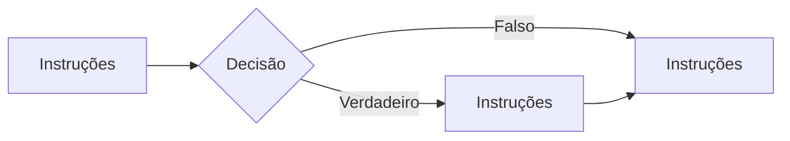
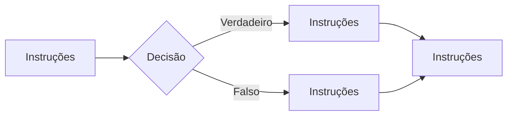
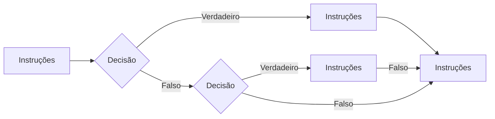

# Fluxo de Controle


## Estruturas de Decisões

### if-else-then



``` java
instruções;
if(DECISAO){
  instruções;
}
instruções;
```



``` java
instruções;
if(DECISAO){
  instruções;
}else{
  instruções;
}
instruções;
```




``` java
instruções;
if(DECISAO){
  instruções;
}else if(DECISAO){
  instruções;
}
instruções;
```

### switch

## Estruturas de Repetições

## for

## while

## do-while 

## Comandos break e continue
