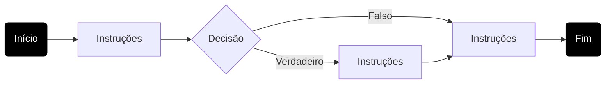
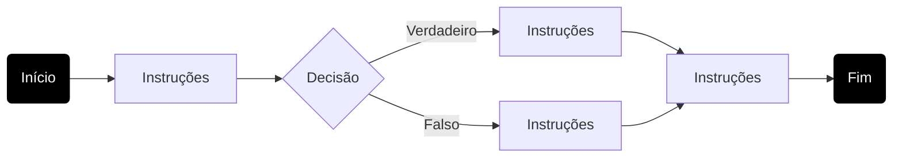
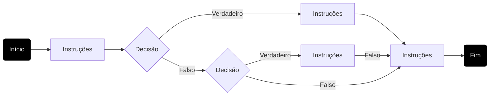
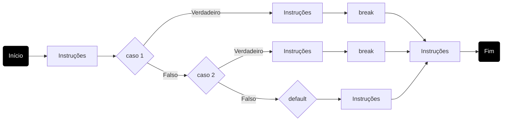
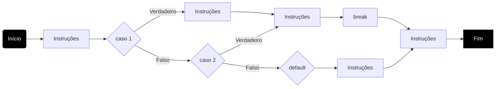
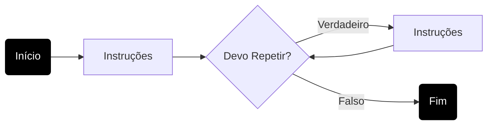
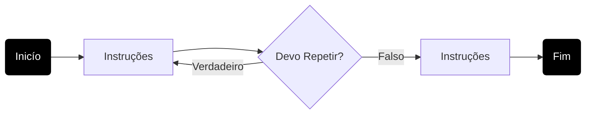

# Fluxo de Controle


## Estruturas de Decisões

### if-else-then



``` java
instruções;
if(DECISAO){
  instruções;
}
instruções;
```



``` java
instruções;
if(DECISAO){
  instruções;
}else{
  instruções;
}
instruções;
```




``` java
instruções;
if(DECISAO){
  instruções;
}else if(DECISAO){
  instruções;
}
instruções;
```

### switch



``` java
instruções;
switch(VARIAVEL){
  case 1:
      instruções;
      break;
  case 2:
      instruções;
      break;
  default
      instruções;
}
instruções;
```



``` java
instruções;
switch(VARIAVEL){
  case 1:
      instruções;
  case 2:
      instruções;
      break;
  default
      instruções;
}
instruções;
```

## Estruturas de Repetições



## for

## while

## do-while 



## Comandos break e continue
